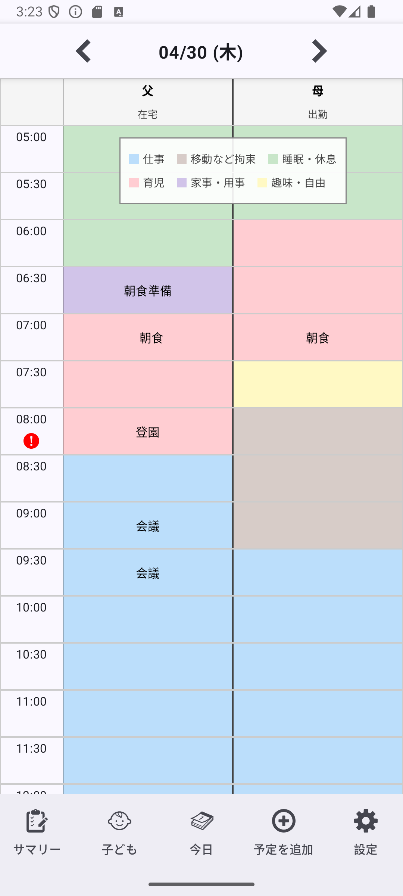
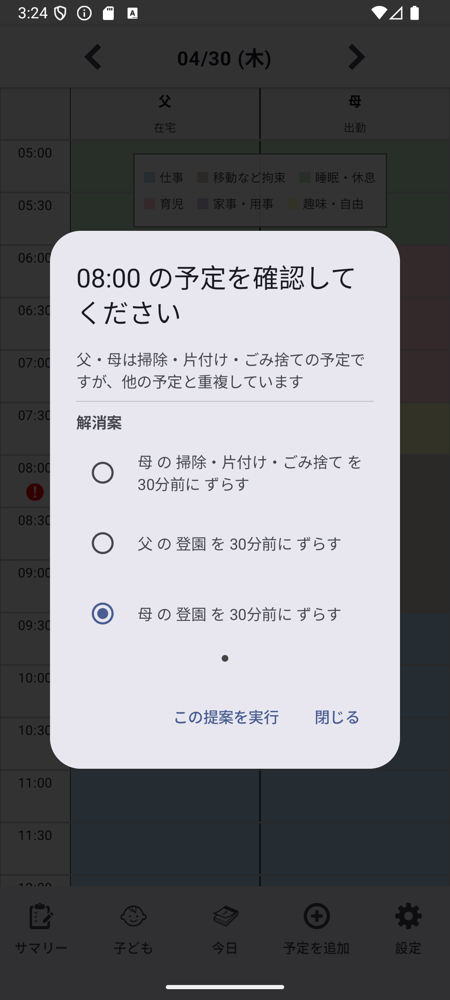
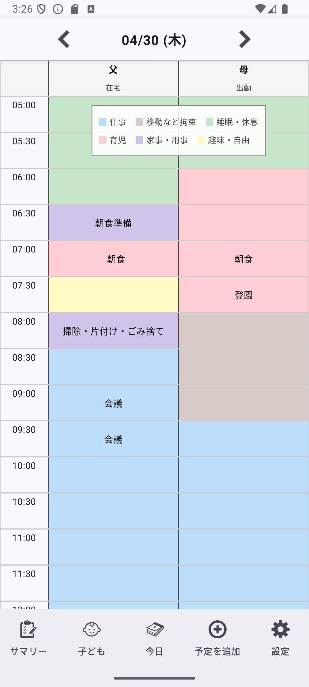
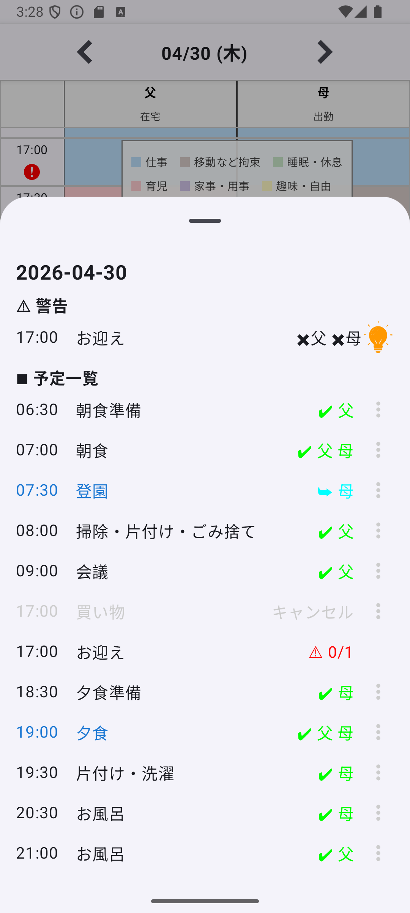

# FamilyScheduler

家庭向けの意思決定支援アプリ
日々異なる条件でのスケジュールを **可視化・最適化** します

---

## 🇯🇵 日本語

### 🧭 概要

FamilySchedulerは、家庭内の予定や役割分担を
**「制約付きスケジューリング」** として扱う意思決定支援アプリです。

単なるカレンダーではなく、
家族の日々の予定を調整・最適化するための
小さな意思決定エンジンとして設計されています。

---

### 🧠 このアプリを作った背景

このアプリは、開発者自身の課題から生まれました。

共働きで子育てを行うなかで、以下のような判断が日々発生します：

* 誰が子どもの送り迎えをするのか
* 仕事と家庭の予定は両立できるのか
* 急な変更にどう対応するのか

特に日本では、

* 父親の育児参加が一般的になりつつある
* 共働き世帯の増加
* 働き方の多様化（リモート・フレックスなど）

といった背景により、
**「毎日同じではない生活の調整」** が求められています。

---

### 🎯 想定ユーザー

* 共働き世帯
* 子育て中の家庭
* 日々の役割分担に負担を感じている人

---

### 🧭 コンセプト

日常生活には、多くの「小さな意思決定」が存在します。

* 今日は誰が対応するのか
* この予定は成立するのか
* 育児と仕事が衝突したとき、どう調整するか

これらは1日単位の問題として扱われがちですが、
実際には「時間・人・制約」が絡み合った複雑な状況です。

FamilySchedulerは、それらを

> **「見える形」に可視化し、意思決定を支援する**

ことを目的としています。

単に予定を管理するのではなく、

* 時間を扱いやすい単位に分解し
* 問題が発生している時刻を検出し
* 解決の選択肢を提示する

ことで、日常の判断負荷を軽減します。

---

### ⚙️ 基本の考え方

このアプリでは、手動で予定を割り当てる代わりに
以下のプロセスで処理を行います：

1. Requirement（要件）を定義する

    * いつ・誰が・何をする必要があるか

2. Solverが割り当てを実行する

    * 条件に基づき自動で担当を決定

3. Evaluationで問題を検出する

    * 人手不足・競合を検知

4. Proposalで解決案を提示する

    * 代替案の提示・適用・取り消し

5. ユーザーによる調整

    * スケジュール変更（出勤 / 在宅勤務など）
    * 予定のキャンセル・割り当て変更

---

### ✨ 主な機能

* 📅 タイムラインベースの日次表示
* 🤖 自動割り当て（Solver）
* ⚠️ 警告・競合検出
* 💡 Proposalによる調整支援
* 🔁 上書き操作（AUTO / REVERSE / CANCELED）
* 👶 子どもルーティン連携（送迎など）

---

### 🧠 設計思想

多くのスケジューラは、
「ユーザーが決めた予定をストックする」ことを前提に設計されています。

このFamilySchedulerは、

> **「意思決定の一部をシステムに委ね、予定を生成してもらう」**

というアプローチを取っています。

これは完全な自動化を目指すものではありません。
目的は、

> **問題を可視化し、日常における認知負荷を減らすこと**

です。

---

### 🏗 アーキテクチャ概要

* Schedule層

    * 勤務パターンのテンプレート管理

* ChildRoutine層

    * 子どもの生活習慣を親タスクに変換

* Requirement層

    * タスクと条件の定義

* Override層

    * ユーザーによる調整

* Solver

    * 割り当てロジック

* Evaluation

    * 問題検出

* Proposal

    * 解決案の提示

---

### 📱 現在の状態

* Androidアプリ（ローカルのみ）
* 開発進捗：約80%
* UIは日本語のみ対応

---

### 📸 スクリーンショット

  
  
  
  

---

### 🚧 今後の予定

* Proposal UIの改善
* 永続化の最適化（Room / DataStore）
* クラウド同期（将来的に検討）
* ユーザーテストと改善

---

### 🤝 このプロジェクトの位置づけ

単なる1アプリではなく、
次のテーマに対するプロジェクトのひとつです：

* 家庭内の意思疎通を円滑にすること
* 人間とシステムの協働（システムが補助し、人が決める設計）

---

### 📝 ライセンス

TBD

---

## 🌍 English

### 🧭 Overview

FamilyScheduler is a constraint-based scheduling engine
designed to support decision-making in households.

It is not just a planner —
it is a system for optimizing how families allocate time and responsibilities.

---

### 🧠 Background

This project originated from the developer’s own experience.

In dual-income households with children, everyday life involves constant decisions:

* Who handles childcare today?
* Can work and family schedules coexist?
* How should we respond to unexpected changes?

In Japan:

* Fathers are increasingly involved in childcare
* Dual-income households are becoming the norm
* Work styles are diversifying

As a result, families must deal with dynamic, day-by-day decision-making.

---

### 🎯 Target Users

* Dual-income households
* Families with children
* People struggling with daily coordination

---

### 🧭 Concept

Daily life involves many small decisions:

* Who does what today?
* Can this schedule work?
* How should conflicts be resolved?

These are complex situations involving time, people, and constraints.

FamilyScheduler aims to:

> **Make these situations visible and support decision-making**

It:

* Breaks time into manageable units
* Detects where issues arise
* Provides actionable alternatives

to reduce cognitive load in everyday life.

---

### ⚙️ Core Idea

1. Define requirements
2. Run a solver
3. Detect conflicts
4. Suggest alternatives
5. Allow user adjustments

---

### ✨ Features

* 📅 Timeline-based daily overview
* 🤖 Automatic task assignment
* ⚠️ Conflict detection
* 💡 Proposal-based resolution
* 🔁 Override system
* 👶 Child routine integration

---

### 🧠 Philosophy

Most scheduling apps assume:

> Humans decide everything.

This FamilyScheduler explores:

> What if decisions are partially delegated to a system?

The goal is not full automation,
but to visualize constraints and reduce cognitive load.

---

### 🏗 Architecture

* Requirement Layer
* Override Layer
* Solver Engine
* Evaluation Engine
* Proposal System

---

### 📱 Status

* Local Android app
* ~80% complete
* Under active development

---

### 🚧 Roadmap

* Improve proposal UX
* Optimize persistence
* Add cloud sync
* User testing

---

### 📝 License

TBD
